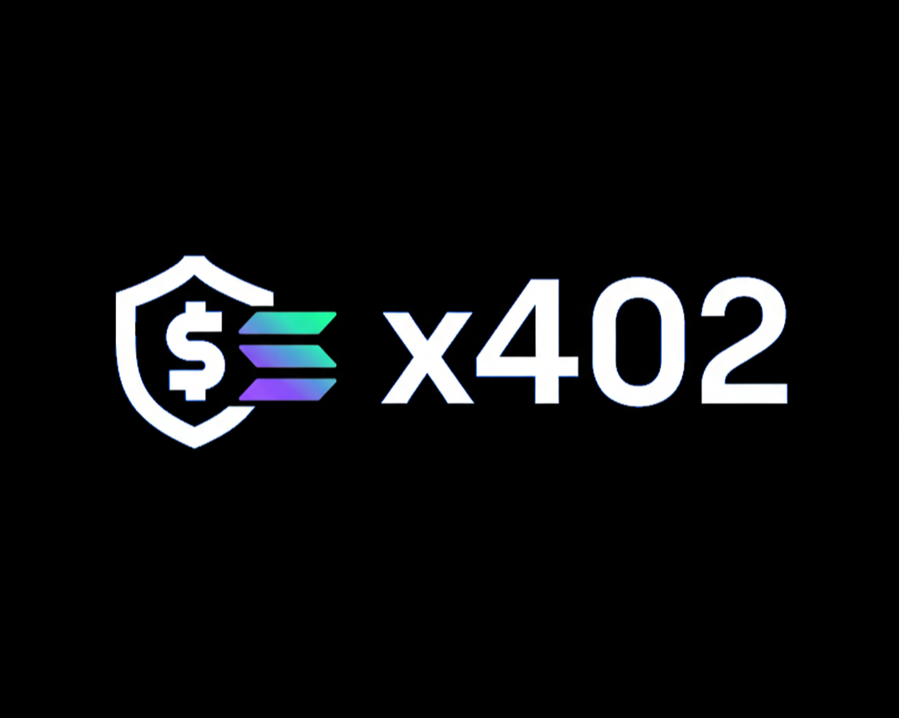

<div align="center">

<p></p>



<p></p>

<h1>SOLx402 MCP Server</h1>

<p>
<a href="https://www.x402.org/" target="_blank">

</a>
&nbsp;&nbsp;
<a href="https://smithery.ai/server/@leandrogavidia/solx402-mcp-server" target="_blank">

</a>
</p>

<p></p>

<p>SOLx402 MCP Server is a Model Context Protocol (MCP) server that enables AI assistants to interact with the x402 payment protocol on Solana. It provides tools for discovering and consuming x402-enabled services, managing USDC payments, querying protocol documentation, and accessing Solana development resources through integrated MCP clients.</p>

<a href="#" target="_blank">Official page</a>
</div>

## Diagram flow


## Integration 

To integrate the **SOLx402 MCP Server**, follow these steps:

1. Go to the [SOLx402 MCP Server Smithery page](https://smithery.ai/server/@leandrogavidia/solx402-mcp-server).
2. Sign in.
3. Click the Configure button.
4. Fill in the required fields (and optional fields, if needed).
5. Generate the URL using your API key and Profile, then copy it.
6. Add the generated MCP Server URL to your system (e.g., Claude, Cursor, VS Code, etc.).

    ```json
    {
        "mcpServers": {
                "solx402-mcp-server": {
                    "url": "https://server.smithery.ai/@leandrogavidia/solx402-mcp-server/mcp?api_key=<YOUR-SMITHERY-API-KEY>&profile=<YOUR-SMITHERY-PROFILE>",
                    "type": "streamable-http",
                    "timeout": 120000
                },
            }
    }
    ```

## Tools

- ### x402 Protocol

    - **Documentation**
        
        - `search_x402_documentation`: Search across the x402 documentation to find relevant information, code examples, API references, and guides.
        
        - `x402_protocol_flow`: Visual diagram showing the x402 protocol flow and architecture.

    - **Services Discovery**
        
        - `get_x402_services`: Retrieve a list of available x402 services from the facilitator.
        
        - `get_facilitators`: Retrieve a list of known Solana facilitators.

    - **Service Consumption**
        
        - `consume_x402_service`: Consume a specific x402 service with automatic payment handling.
        
            > **⚠️ Note:** x402 services are external services maintained by third-party teams. While these services appear in the discovery layer, they may be temporarily down, unavailable, or experiencing issues. Service availability depends entirely on the external teams managing them.

- ### Wallet Operations

    - **Wallet Info**
        
        - `get_wallet_public_key`: Retrieve the public key of the configured wallet.

    - **Balance**
        
        - `get_wallet_usdc_balance`: Check the USDC token balance of the configured wallet.

- ### Solana Development Resources (Optional)

    - **Expert Assistance**
        
        - `Ask_Solana_Anchor_Framework_Expert`: Ask questions about developing on Solana with the Anchor Framework.
        
        - `Solana_Expert__Ask_For_Help`: Get expert help on Solana development topics, concepts, APIs, SDKs, and errors.

    - **Documentation**
        
        - `Solana_Documentation_Search`: Search documentation across the Solana ecosystem for up-to-date information.

---

## ⚠️ Important: Request Timeout Configuration

**Critical Setup Requirement:** When using this MCP server, it's essential to configure your MCP client with a **minimum request timeout of 60,000ms (60 seconds)** to ensure successful execution of x402 service consumption.

### Why This Matters:

- x402 services are external APIs that may require significant processing time.
- Payment transactions are executed on the Solana blockchain, which can take time to confirm.
- Short timeouts can cause requests to fail **after** USDC has been charged, resulting in payment without receiving the service.
- By default, MCP servers use a maximum request timeout of 10 seconds when running, which is quite low in some cases.

### Configuration Examples:

```json
{
  "mcpServers": {
    "solx402": {
      "url": "https://server.smithery.ai/@leandrogavidia/solx402-mcp-server/mcp?api_key=<YOUR-SMITHERY-API-KEY>&profile=<YOUR-SMITHERY-PROFILE>",
      "type": "streamable-http",
      "timeout": 120000 // 2 Minutes
    }
  }
}
```

### Query Parameters:

The MCP server now accepts configuration through URL query parameters, making setup simpler and more flexible:

- **`privateKey`** (required): Base58-encoded private key for your Solana wallet
- **`mainnetRpcUrl`** (required): Solana RPC URL for mainnet operations

- **`isMainnet`** (optional): Set to true for mainnet, false for devnet (Default: false)
- **`facilitatorUrl`** (optional): URL of the x402 facilitator (default: PayAI Facilitator URL)
- **`maxPrice`** (optional): Maximum price to pay for services in USDC microcents, e.g. 10000 = 0.01 USDC (default: 0)
- **`useSolanaMcpServer`** (optional): Enable Solana development tools integration (default: false)

**Example URL:**
```bash
http://127.0.0.1:8001/mcp?privateKey=5J2K...&mainnetRpcUrl=https://api.mainnet-beta.solana.com&maxPrice=50000&useSolanaMcpServer=true&isMainnet=true&facilitatorUrl=https://facilitator.payai.network
```

### Related Issues:
- [Cline PR #1904](https://github.com/cline/cline/pull/1904) - Request timeout configuration
- [Cline Issue #4391](https://github.com/cline/cline/issues/4391) - Timeout-related problems

**Note:** Always ensure your MCP client timeout is at least 120 seconds to prevent payment issues and service consumption failures.

---

## Configuration Options

### 1. Query Parameters 
Pass configuration directly in the MCP client URL as shown in the examples above.

### 2. Environment Variables
You can use environment variables:

- `PORT`: Port where your MCP server will run (default: 8001)
- `HOST`: Host where your MCP server will run (default: 127.0.0.1)

## Development Setup

### Quick Start (Without Compilation)

1. **Terminal 1** - Start the development server:
   ```bash
   pnpm dev
   ```

2. **Terminal 2** - Run the MCP server inspector:
   ```bash
   pnpm run stdio 
   ```

    Then, in the following fields, add this setup:

    1. **Transport Type:** Streamable HTTP
    
    2. **URL:** http://127.0.0.1:8001/mcp?privateKey=<your-private-key>&mainnetRpcUrl=<your-mainnet-rpc>

    3. **Configuration:** 

        3.1 **Request Timeout:** 120000

    Then, click the Connect button.

    **Note:** If you encounter the following error:

    ```
    Connection Error - Check if your MCP server is running and proxy token is correct
    ``` 

    please verify your URL and query parameters and review the terminal logs.


### Build and Run (Production)

1. Build the project:
   ```bash
   pnpm run build
   ```

2. Start the server:
   ```bash
   pnpm run start
   ```

**Note:** For MCP client integration, use the HTTP mode with query parameters as shown in the configuration examples above.

---

## License: MIT